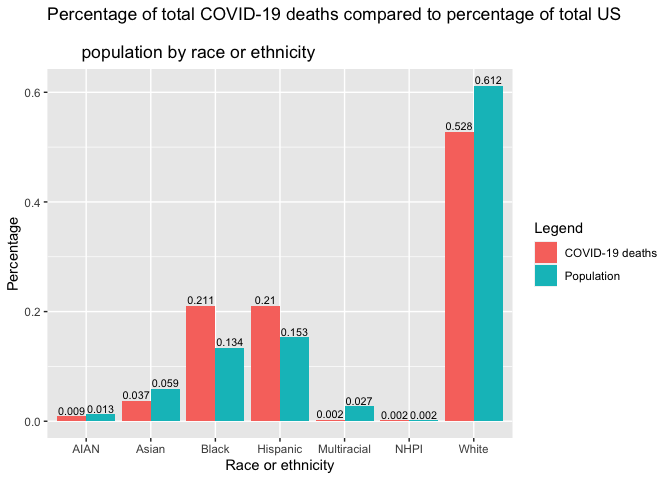

<!-- README.md is generated from README.Rmd. Please edit that file -->

# CovidRaceData

<!-- badges: start -->


<!-- badges: end -->

The `CovidRaceData` package contains two data sets on the COVID-19
pandemic in the US by race/ethnicity. More specifically, it has data for
the number of COVID-19 cases and deaths by race/ethnicity for each
state.

The raw data set (`covid_race_data_raw`) was obtained from [The COVID
Tracking
Project](https://covidtracking.com/race/about#download-the-data) and
contains the number of COVID-19 cases and deaths by race/ethnicity by US
state (as well as each state’s population).

The `aggregated_covid_race_df` contains information on the percent of
cases/deaths by race/ethnicity vs. the percent of the population that
each race/ethnicity composes in the US.

## Installation

You can install the released version of CovidRaceData from
[CRAN](https://CRAN.R-project.org) with:

``` r
# install.packages("remotes")
remotes::install_github("Oliver-BE/CovidRaceData")
```

## Example Usage

### Visualization

Some examples of how to visualize the included data sets can be shown in
the graph of COVID-19 cases per 100,000 people by race/ethnicity below:

``` r
library(CovidRaceData)
library(ggplot2)
library(reshape2)
```

``` r
# COVID-19 cases per 100,000 people by race or ethnicity
ggplot(aggregated_covid_race_df, aes(x = reorder(Race, Cases_Per_100K), y = Cases_Per_100K)) +
  geom_bar(stat = "identity", fill = "steelblue") +
  geom_text(aes(label = round(Cases_Per_100K, 0)),
          position = position_dodge(width=0.9), vjust=-0.25) +
  labs(x = "Race or ethnicity", y = "Cases per 100,000 people",
      title = "COVID-19 cases per 100,000 people by race or ethnicity")
```


### Analysis

We can also use the provided data sets to answer questions such as
whether or not there is a significant difference in the number of
COVID-19 deaths by race or ethnicity in the United States. To do so, we
can compare the proportion of US population by race/ethnicity to the
proportion of COVID-19 deaths by race/ethnicity. We begin with a visual
representation:

``` r
# percentage of total COVID-19 deaths compared to percentage of total US 
# population by race or ethnicity
df_deaths_population_by_percent <- melt(data.frame(aggregated_covid_race_df$Race,
                            aggregated_covid_race_df$Deaths_Percent,
                            aggregated_covid_race_df$Population_Percent)) 
#> Using aggregated_covid_race_df.Race as id variables
colnames(df_deaths_population_by_percent) <- c("Race", "Variable", "Value")

ggplot(df_deaths_population_by_percent, aes(x = Race, y = Value, fill = Variable)) +
  geom_bar(stat = "identity", position = "dodge") +
  geom_text(aes(label = round(Value, 3)),
            position = position_dodge(width = 0.9), vjust = -0.25, size = 2.85) +
  scale_fill_discrete(labels = c("COVID-19 deaths", "Population")) +
  labs(x = "Race or ethnicity", y = "Percentage", fill = "Legend",
       title = "Percentage of total COVID-19 deaths compared to percentage of total US \n
       population by race or ethnicity")
```



#### Chi-Squared Test

To test if the proportion of US population by race/ethnicity are
significantly different than the proportion of deaths by race/ethnicity,
we can carry out a chi-squared test. To carry out this test we first
check our assumptions. We assume here that each data point is
independent of one another and we can verify that 80% of expected counts
are greater than 5. Thus, our assumptions are met.

Our null hypothesis here is that the distribution of our sample data
(the number of COVID-19 deaths by race) matches the distribution of the
population of the US by race.

Our alternative hypothesis here is that the distribution of our sample
data does not match the distribution of the population of the US by
race.

``` r
observed_frequency_deaths <- aggregated_covid_race_df$Deaths_Total
expected_frequency <- aggregated_covid_race_df$Population_Percent

chisq.test(observed_frequency_deaths, p = expected_frequency) 
#> 
#>  Chi-squared test for given probabilities
#> 
#> data:  observed_frequency_deaths
#> X-squared = 20960, df = 6, p-value < 2.2e-16
```

Our observed test statistic \(X^2\) is 20960 and our p-value is 2.2e-16.
Thus at a significance level \(\alpha=0.01\) we can reject the null
hypothesis and conclude that there’s sufficient evidence to suggest that
the distribution of the number of COVID-19 deaths by race does not match
the distribution of the population of the US by race. This means that
the distribution of COVID-19 deaths by race do not match what we would
expect them to be (based on the distribution of population by race).

#### ANOVA Test

We can also carry out an ANOVA test to check for difference in group
means.

Our null hypothesis here is that all of the group means are equal
(there’s an equal number of COVID-19 deaths for each race/ethnicity).
Our alternative hypothesis is that the group means are not equal for all
of the groups.

``` r
cases_model <- lm(Deaths_Per_100K ~ Race, data = aggregated_covid_race_df)
anova(cases_model)
#> Analysis of Variance Table
#> 
#> Response: Deaths_Per_100K
#>           Df Sum Sq Mean Sq F value Pr(>F)
#> Race       6 5008.2  834.69               
#> Residuals  0    0.0
```

We observe an essentially perfect fit for this ANOVA F-test, meaning
that we can reject the null hypothesis and conclude that the number of
COVID-19 deaths is different across different races/ethnicities in the
US. This matches what we saw in our EDA above, where there was very
clearly a difference in the number of deaths between races (for example,
92 cases for every 100,000 Black people vs 51 white people).
